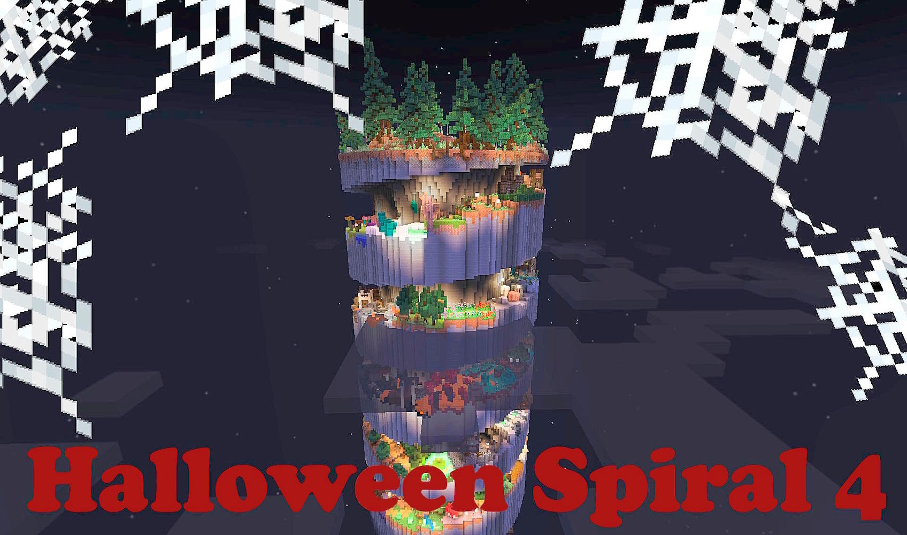
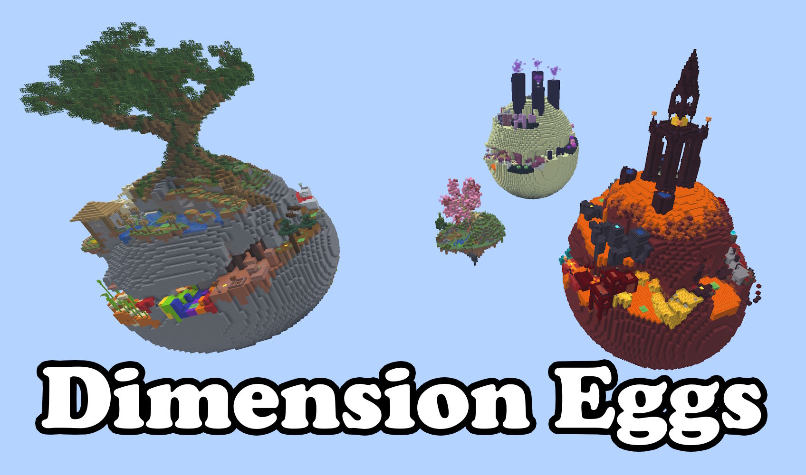

# Community Archive - Maps by community creators

_Generated: 2026-09-20 15:33 UTC_

Quelle: `https://hielkemaps.com/maps/` und `https://hielkemaps.com/community-maps/`.

Versionen werden aus `level.dat` (NBT, via `nbt2yaml`) gelesen; bei unlesbaren Dateien steht `Unknown`. Die Spalte **Download** zeigt auf das ZIP im passenden GitHub-Release, **Archive.org** auf den Wayback-Snapshot (`-` = kein Wayback-Eintrag vorhanden).

## [Halloween Spiral](https://hielkemaps.com/community-maps/)

<!-- Source download: https://hielkemaps.com/downloads/community/Halloween%20Spiral.zip -->

| Minecraft Java | Snapshot (UTC) | Download | Archive.org | SHA1 |
|---|---|---|---|---|
| 1.17.1 | 2026-02-11 18:21:08 | [ZIP](https://github.com/GammelSami/hielkemaps-archive/releases/download/map-halloween-spiral/20260211182108__1.17.1.zip) | [Link](https://web.archive.org/web/20260920101702if_/https://hielkemaps.com/downloads/community/Halloween%20Spiral.zip) | `8dbd31ea7a4e` |

## [Halloween Spiral 2](https://hielkemaps.com/community-maps/)

<!-- Source download: https://hielkemaps.com/downloads/community/Halloween%20Spiral%202.zip -->

| Minecraft Java | Snapshot (UTC) | Download | Archive.org | SHA1 |
|---|---|---|---|---|
| 1.19.2 | 2026-02-11 18:21:35 | [ZIP](https://github.com/GammelSami/hielkemaps-archive/releases/download/map-halloween-spiral-2/20260211182135__1.19.2.zip) | [Link](https://web.archive.org/web/20260920101738if_/https://hielkemaps.com/downloads/community/Halloween%20Spiral%202.zip) | `5dfb12bc2843` |

## [Halloween Spiral 3](https://hielkemaps.com/community-maps/)

<!-- Source download: https://hielkemaps.com/downloads/community/Halloween%20Spiral%203.zip -->

| Minecraft Java | Snapshot (UTC) | Download | Archive.org | SHA1 |
|---|---|---|---|---|
| 1.20.2 | 2026-02-11 18:22:20 | [ZIP](https://github.com/GammelSami/hielkemaps-archive/releases/download/map-halloween-spiral-3/20260211182220__1.20.2.zip) | [Link](https://web.archive.org/web/20260211182220if_/https://hielkemaps.com/downloads/community/Halloween%20Spiral%203.zip) | `babd22d1f74a` |

## [Halloween Spiral 4](https://hielkemaps.com/community-maps/)

<!-- Source download: https://hielkemaps.com/downloads/community/Halloween%20Spiral%204.zip -->

| Minecraft Java | Snapshot (UTC) | Download | Archive.org | SHA1 |
|---|---|---|---|---|
| 1.21.4 | 2026-02-11 18:22:47 | [ZIP](https://github.com/GammelSami/hielkemaps-archive/releases/download/map-halloween-spiral-4/20260211182247__1.21.4.zip) | [Link](https://web.archive.org/web/20260920101832if_/https://hielkemaps.com/downloads/community/Halloween%20Spiral%204.zip) | `0861e532ce3b` |

## [Halloween Spiral 5](https://hielkemaps.com/community-maps/)

<!-- Source download: https://hielkemaps.com/downloads/community/Halloween%20Spiral%205.zip -->

| Minecraft Java | Snapshot (UTC) | Download | Archive.org | SHA1 |
|---|---|---|---|---|
| 1.21.11 | 2026-09-20 02:12:39 | [ZIP](https://github.com/GammelSami/hielkemaps-archive/releases/download/map-halloween-spiral-5/20260920021239__1.21.11.zip) | [Link](https://web.archive.org/web/20260920101911if_/https://hielkemaps.com/downloads/community/Halloween%20Spiral%205.zip) | `05a2efa3b753` |

## [Dimension Eggs](https://hielkemaps.com/community-maps/)

<!-- Source download: https://hielkemaps.com/downloads/community/Dimension%20Eggs.zip -->

| Minecraft Java | Snapshot (UTC) | Download | Archive.org | SHA1 |
|---|---|---|---|---|
| 1.18.2 | 2026-02-11 18:23:19 | [ZIP](https://github.com/GammelSami/hielkemaps-archive/releases/download/map-dimension-eggs/20260211182319__1.18.2.zip) | [Link](https://web.archive.org/web/20260920102011if_/https://hielkemaps.com/downloads/community/Dimension%20Eggs.zip) | `54e68f3c3865` |

## [Christmas Pyramid](https://hielkemaps.com/community-maps/)

<!-- Source download: https://hielkemaps.com/downloads/community/Christmas%20Pyramid.zip -->

| Minecraft Java | Snapshot (UTC) | Download | Archive.org | SHA1 |
|---|---|---|---|---|
| 1.17.1 | 2026-02-11 18:23:39 | [ZIP](https://github.com/GammelSami/hielkemaps-archive/releases/download/map-christmas-pyramid/20260211182339__1.17.1.zip) | [Link](https://web.archive.org/web/20260920102046if_/https://hielkemaps.com/downloads/community/Christmas%20Pyramid.zip) | `56613d67842a` |

## [Summer Paradise](https://hielkemaps.com/community-maps/)

<!-- Source download: https://hielkemaps.com/downloads/community/Summer%20Paradise.zip -->

| Minecraft Java | Snapshot (UTC) | Download | Archive.org | SHA1 |
|---|---|---|---|---|
| 1.20.2 | 2026-02-11 18:24:05 | [ZIP](https://github.com/GammelSami/hielkemaps-archive/releases/download/map-summer-paradise/20260211182405__1.20.2.zip) | [Link](https://web.archive.org/web/20260211182405if_/https://hielkemaps.com/downloads/community/Summer%20Paradise.zip) | `42bf58ddf7f1` |

## [Summer Paradise 2](https://hielkemaps.com/community-maps/)

<!-- Source download: https://hielkemaps.com/downloads/community/Summer%20Paradise%202.zip -->

| Minecraft Java | Snapshot (UTC) | Download | Archive.org | SHA1 |
|---|---|---|---|---|
| 1.21.11 | 2026-09-20 02:13:04 | [ZIP](https://github.com/GammelSami/hielkemaps-archive/releases/download/map-summer-paradise-2/20260920021304__1.21.11.zip) | [Link](https://web.archive.org/web/20260920102505if_/https://hielkemaps.com/downloads/community/Summer%20Paradise%202.zip) | `dbdae05ba671` |

## [Winter Paradise](https://hielkemaps.com/community-maps/)

<!-- Source download: https://hielkemaps.com/downloads/community/Winter%20Paradise.zip -->

| Minecraft Java | Snapshot (UTC) | Download | Archive.org | SHA1 |
|---|---|---|---|---|
| 1.19.2 | 2026-02-11 18:25:02 | [ZIP](https://github.com/GammelSami/hielkemaps-archive/releases/download/map-winter-paradise/20260211182502__1.19.2.zip) | [Link](https://web.archive.org/web/20260920102543if_/https://hielkemaps.com/downloads/community/Winter%20Paradise.zip) | `e6278d994ec5` |

## [Candy Cane Parkour](https://hielkemaps.com/community-maps/)

<!-- Source download: https://hielkemaps.com/downloads/community/Candy%20Cane%20Parkour.zip -->

| Minecraft Java | Snapshot (UTC) | Download | Archive.org | SHA1 |
|---|---|---|---|---|
| 1.20.4 | 2026-02-11 18:25:34 | [ZIP](https://github.com/GammelSami/hielkemaps-archive/releases/download/map-candy-cane-parkour/20260211182534__1.20.4.zip) | [Link](https://web.archive.org/web/20260920102634if_/https://hielkemaps.com/downloads/community/Candy%20Cane%20Parkour.zip) | `ad15db15ec67` |

## Fehler/Unklare Faelle

- Halloween Spiral 3
  - Wayback save failed: This URL has been already captured 1 times today, which is a daily limit we have set for that Resource type. Please try again tomorrow. Please email us at "info@archive.org" if you would like to discuss this more.
- Summer Paradise
  - Wayback save failed: This URL has been already captured 1 times today, which is a daily limit we have set for that Resource type. Please try again tomorrow. Please email us at "info@archive.org" if you would like to discuss this more.
