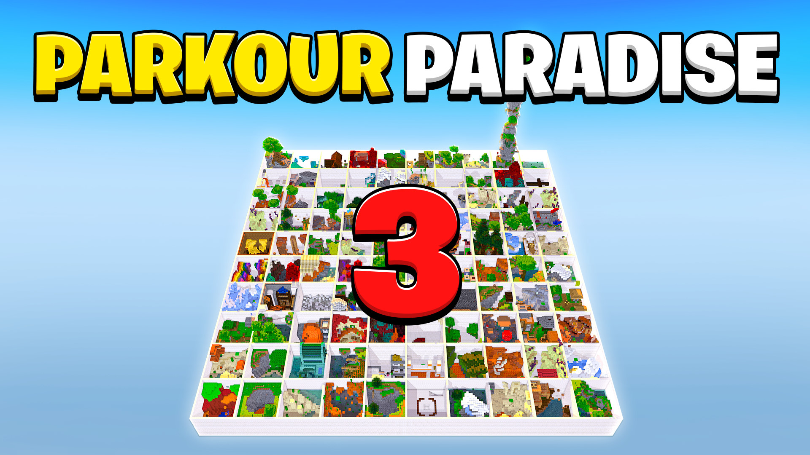
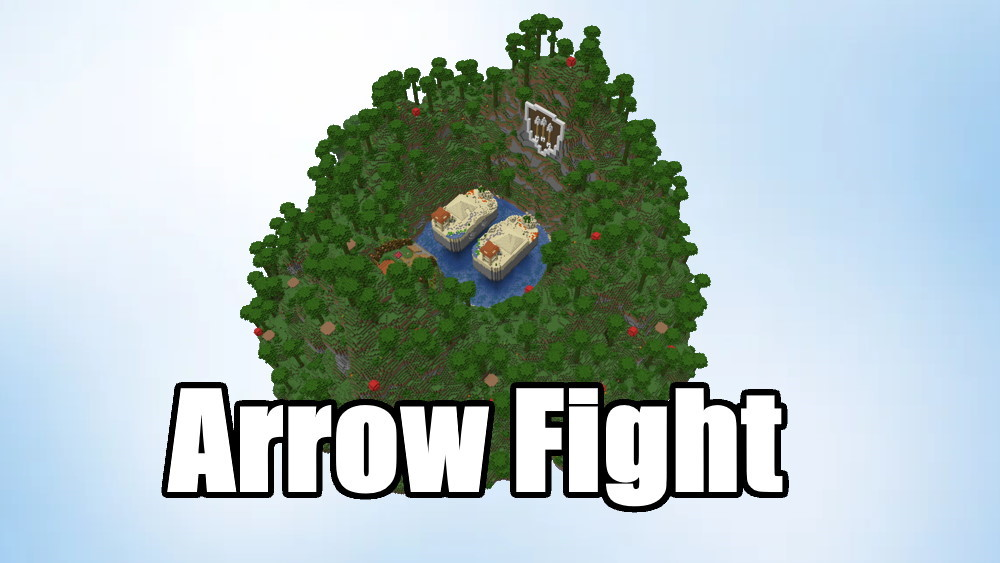

# Community Archive - Maps by Hielke

_Generated: 2026-09-20 15:33 UTC_

Quelle: `https://hielkemaps.com/maps/` und `https://hielkemaps.com/community-maps/`.

Versionen werden aus `level.dat` (NBT, via `nbt2yaml`) gelesen; bei unlesbaren Dateien steht `Unknown`. Die Spalte **Download** zeigt auf das ZIP im passenden GitHub-Release, **Archive.org** auf den Wayback-Snapshot (`-` = kein Wayback-Eintrag vorhanden).

## [Parkour Volcano](https://hielkemaps.com/maps/parkour-volcano)

<!-- Source download: https://hielkemaps.com/downloads/Parkour%20Volcano.zip -->

| Minecraft Java | Snapshot (UTC) | Download | Archive.org | SHA1 |
|---|---|---|---|---|
| 26.2 | 2026-09-20 02:13:21 | [ZIP](https://github.com/GammelSami/hielkemaps-archive/releases/download/map-parkour-volcano/20260920021321__26.2.zip) | [Link](https://web.archive.org/web/20260920025115if_/https://hielkemaps.com/downloads/Parkour%20Volcano.zip) | `ce10b0daec70` |
| 1.21.11 | 2026-02-11 18:14:18 | [ZIP](https://github.com/GammelSami/hielkemaps-archive/releases/download/map-parkour-volcano/20260211181418__1.21.11.zip) | [Link](https://web.archive.org/web/20260211180110if_/https://hielkemaps.com/downloads/Parkour%20Volcano.zip) | `80263ce728c1` |
| 1.21.5 | 2025-06-12 19:56:14 | [ZIP](https://github.com/GammelSami/hielkemaps-archive/releases/download/map-parkour-volcano/20250612195614__1.21.5.zip) | [Link](https://web.archive.org/web/20250612195614if_/https://hielkemaps.com/downloads/Parkour%20Volcano.zip) | `123d16480a6a` |
| 1.21.4 | 2025-04-14 04:46:08 | [ZIP](https://github.com/GammelSami/hielkemaps-archive/releases/download/map-parkour-volcano/20250414044608__1.21.4.zip) | [Link](https://web.archive.org/web/20250414044608if_/https://hielkemaps.com/downloads/Parkour%20Volcano.zip) | `245127a11fd7` |
| 1.21 | 2024-07-11 17:25:58 | [ZIP](https://github.com/GammelSami/hielkemaps-archive/releases/download/map-parkour-volcano/20240711172558__1.21.zip) | [Link](https://web.archive.org/web/20240711172558if_/https://hielkemaps.com/downloads/Parkour%20Volcano.zip) | `48df2a7e0324` |

## [Parkour Egg](https://hielkemaps.com/maps/parkour-egg)

<!-- Source download: https://hielkemaps.com/downloads/Parkour%20Egg.zip -->

| Minecraft Java | Snapshot (UTC) | Download | Archive.org | SHA1 |
|---|---|---|---|---|
| 26.2 | 2026-09-20 02:13:43 | [ZIP](https://github.com/GammelSami/hielkemaps-archive/releases/download/map-parkour-egg/20260920021343__26.2.zip) | [Link](https://web.archive.org/web/20260920024512if_/https://hielkemaps.com/downloads/Parkour%20Egg.zip) | `bb29e7d0ca64` |
| 1.21.11 | 2026-02-11 18:14:37 | [ZIP](https://github.com/GammelSami/hielkemaps-archive/releases/download/map-parkour-egg/20260211181437__1.21.11.zip) | [Link](https://web.archive.org/web/20260211180901if_/https://hielkemaps.com/downloads/Parkour%20Egg.zip) | `c5acf52d5d8a` |
| 1.21.5 | 2025-07-06 12:44:51 | [ZIP](https://github.com/GammelSami/hielkemaps-archive/releases/download/map-parkour-egg/20250706124451__1.21.5.zip) | [Link](https://web.archive.org/web/20250706124451if_/https://hielkemaps.com/downloads/Parkour%20Egg.zip) | `d23a0c223201` |
| 1.20.4 | 2024-03-16 14:17:58 | [ZIP](https://github.com/GammelSami/hielkemaps-archive/releases/download/map-parkour-egg/20240316141758__1.20.4.zip) | [Link](https://web.archive.org/web/20240316141758if_/https://hielkemaps.com/downloads/Parkour%20Egg.zip) | `c9a6682f7a7e` |
| 1.19.4 | 2023-06-05 14:54:50 | [ZIP](https://github.com/GammelSami/hielkemaps-archive/releases/download/map-parkour-egg/20230605145450__1.19.4.zip) | [Link](https://web.archive.org/web/20230605145450if_/https://hielkemaps.com/downloads/Parkour%20Egg.zip) | `ab130c84eda5` |

## [Parkour Town](https://hielkemaps.com/maps/parkour-town)

<!-- Source download: https://hielkemaps.com/downloads/Parkour%20Town.zip -->

| Minecraft Java | Snapshot (UTC) | Download | Archive.org | SHA1 |
|---|---|---|---|---|
| 26.2 | 2026-09-20 02:14:12 | [ZIP](https://github.com/GammelSami/hielkemaps-archive/releases/download/map-parkour-town/20260920021412__26.2.zip) | [Link](https://web.archive.org/web/20260920102916if_/https://hielkemaps.com/downloads/Parkour%20Town.zip) | `401ff02d417c` |
| 1.21.11 | 2026-02-11 18:15:01 | [ZIP](https://github.com/GammelSami/hielkemaps-archive/releases/download/map-parkour-town/20260211181501__1.21.11.zip) | [Link](https://web.archive.org/web/20260211181052if_/https://hielkemaps.com/downloads/Parkour%20Town.zip) | `0df35178b3b6` |
| 1.21.5 | 2025-09-02 07:06:30 | [ZIP](https://github.com/GammelSami/hielkemaps-archive/releases/download/map-parkour-town/20250902070630__1.21.5.zip) | [Link](https://web.archive.org/web/20250902070630if_/https://hielkemaps.com/downloads/Parkour%20Town.zip) | `0c08bfcc0ead` |
| 1.19.3 | 2023-01-02 23:05:58 | [ZIP](https://github.com/GammelSami/hielkemaps-archive/releases/download/map-parkour-town/20230102230558__1.19.3.zip) | [Link](https://web.archive.org/web/20230102230558if_/https://hielkemaps.com/downloads/Parkour%20Town.zip) | `7ef7efb2748f` |

## [Parkour Spiral](https://hielkemaps.com/maps/parkour-spiral)

<!-- Source download: https://hielkemaps.com/downloads/Parkour%20Spiral.zip -->

| Minecraft Java | Snapshot (UTC) | Download | Archive.org | SHA1 |
|---|---|---|---|---|
| 26.2 | 2026-09-20 02:14:35 | [ZIP](https://github.com/GammelSami/hielkemaps-archive/releases/download/map-parkour-spiral/20260920021435__26.2.zip) | [Link](https://web.archive.org/web/20260920024816if_/https://hielkemaps.com/downloads/Parkour%20Spiral.zip) | `8808675b8f5c` |
| 1.21.11 | 2026-02-11 18:16:29 | [ZIP](https://github.com/GammelSami/hielkemaps-archive/releases/download/map-parkour-spiral/20260211181629__1.21.11.zip) | [Link](https://web.archive.org/web/20260211181629if_/https://hielkemaps.com/downloads/Parkour%20Spiral.zip) | `7a9086e82b84` |
| 1.21.5 | 2025-12-19 22:00:18 | [ZIP](https://github.com/GammelSami/hielkemaps-archive/releases/download/map-parkour-spiral/20251219220018__1.21.5.zip) | [Link](https://web.archive.org/web/20251219220018if_/https://hielkemaps.com/downloads/Parkour%20Spiral.zip) | `8d14ced62304` |
| 1.21.4 | 2025-02-25 08:53:12 | [ZIP](https://github.com/GammelSami/hielkemaps-archive/releases/download/map-parkour-spiral/20250225085312__1.21.4.zip) | [Link](https://web.archive.org/web/20250225085312if_/https://hielkemaps.com/downloads/Parkour%20Spiral.zip) | `1129adb9a50a` |
| 1.21.3 | 2025-01-15 01:22:55 | [ZIP](https://github.com/GammelSami/hielkemaps-archive/releases/download/map-parkour-spiral/20250115012255__1.21.3.zip) | [Link](https://web.archive.org/web/20250115012255if_/https://hielkemaps.com/downloads/Parkour%20Spiral.zip) | `e8f1ee6cc5da` |
| 1.20.6 | 2024-06-09 19:33:14 | [ZIP](https://github.com/GammelSami/hielkemaps-archive/releases/download/map-parkour-spiral/20240609193314__1.20.6.zip) | [Link](https://web.archive.org/web/20240609193314if_/https://hielkemaps.com/downloads/Parkour%20Spiral.zip) | `706699e14ada` |
| 1.20.4 | 2024-03-13 16:05:30 | [ZIP](https://github.com/GammelSami/hielkemaps-archive/releases/download/map-parkour-spiral/20240313160530__1.20.4.zip) | [Link](https://web.archive.org/web/20240313160530if_/https://hielkemaps.com/downloads/Parkour%20Spiral.zip) | `cd4e6253eeaf` |
| 1.19.3 | 2023-03-17 22:45:17 | [ZIP](https://github.com/GammelSami/hielkemaps-archive/releases/download/map-parkour-spiral/20230317224517__1.19.3.zip) | [Link](https://web.archive.org/web/20230317224517if_/https://hielkemaps.com/downloads/Parkour%20Spiral.zip) | `c16eae72ca22` |
| 1.18.2 | 2022-05-31 11:42:55 | [ZIP](https://github.com/GammelSami/hielkemaps-archive/releases/download/map-parkour-spiral/20220531114255__1.18.2.zip) | [Link](https://web.archive.org/web/20220531114255if_/https://hielkemaps.com/downloads/Parkour%20Spiral.zip) | `58786831c83c` |
| 1.18.1 | 2022-01-28 00:56:05 | [ZIP](https://github.com/GammelSami/hielkemaps-archive/releases/download/map-parkour-spiral/20220128005605__1.18.1.zip) | [Link](https://web.archive.org/web/20220128005605if_/https://hielkemaps.com/downloads/Parkour%20Spiral.zip) | `ec4e973e521e` |

## [Parkour Spiral 2](https://hielkemaps.com/maps/parkour-spiral-2)

<!-- Source download: https://hielkemaps.com/downloads/Parkour%20Spiral%202.zip -->

| Minecraft Java | Snapshot (UTC) | Download | Archive.org | SHA1 |
|---|---|---|---|---|
| 26.2 | 2026-09-20 02:15:16 | [ZIP](https://github.com/GammelSami/hielkemaps-archive/releases/download/map-parkour-spiral-2/20260920021516__26.2.zip) | [Link](https://web.archive.org/web/20260920024853if_/https://hielkemaps.com/downloads/Parkour%20Spiral%202.zip) | `bb9dce1edb16` |
| 1.21.11 | 2026-02-11 18:16:48 | [ZIP](https://github.com/GammelSami/hielkemaps-archive/releases/download/map-parkour-spiral-2/20260211181648__1.21.11.zip) | [Link](https://web.archive.org/web/20260211181648if_/https://hielkemaps.com/downloads/Parkour%20Spiral%202.zip) | `151d81f42361` |
| 1.21.5 | 2025-05-22 16:23:02 | [ZIP](https://github.com/GammelSami/hielkemaps-archive/releases/download/map-parkour-spiral-2/20250522162302__1.21.5.zip) | [Link](https://web.archive.org/web/20250522162302if_/https://hielkemaps.com/downloads/Parkour%20Spiral%202.zip) | `601d2093fe52` |
| 1.21.3 | 2024-11-25 20:27:20 | [ZIP](https://github.com/GammelSami/hielkemaps-archive/releases/download/map-parkour-spiral-2/20241125202720__1.21.3.zip) | [Link](https://web.archive.org/web/20241125202720if_/https://hielkemaps.com/downloads/Parkour%20Spiral%202.zip) | `57132cf11e44` |
| 1.19.4 | 2023-06-05 14:27:42 | [ZIP](https://github.com/GammelSami/hielkemaps-archive/releases/download/map-parkour-spiral-2/20230605142742__1.19.4.zip) | [Link](https://web.archive.org/web/20230605142742if_/https://hielkemaps.com/downloads/Parkour%20Spiral%202.zip) | `22f01ac039f1` |
| 1.18.2 | 2022-05-31 12:02:46 | [ZIP](https://github.com/GammelSami/hielkemaps-archive/releases/download/map-parkour-spiral-2/20220531120246__1.18.2.zip) | [Link](https://web.archive.org/web/20220531120246if_/https://hielkemaps.com/downloads/Parkour%20Spiral%202.zip) | `1b993519d424` |
| 1.18.1 | 2022-02-09 20:14:57 | [ZIP](https://github.com/GammelSami/hielkemaps-archive/releases/download/map-parkour-spiral-2/20220209201457__1.18.1.zip) | [Link](https://web.archive.org/web/20220209201457if_/https://hielkemaps.com/downloads/Parkour%20Spiral%202.zip) | `97902993076b` |

## [Parkour Spiral 3](https://hielkemaps.com/maps/parkour-spiral-3)

<!-- Source download: https://hielkemaps.com/downloads/Parkour%20Spiral%203.zip -->

| Minecraft Java | Snapshot (UTC) | Download | Archive.org | SHA1 |
|---|---|---|---|---|
| 26.2 | 2026-09-20 02:16:03 | [ZIP](https://github.com/GammelSami/hielkemaps-archive/releases/download/map-parkour-spiral-3/20260920021603__26.2.zip) | [Link](https://web.archive.org/web/20260920024935if_/https://hielkemaps.com/downloads/Parkour%20Spiral%203.zip) | `63ca64c943a5` |
| 1.21.11 | 2026-02-11 18:17:14 | [ZIP](https://github.com/GammelSami/hielkemaps-archive/releases/download/map-parkour-spiral-3/20260211181714__1.21.11.zip) | [Link](https://web.archive.org/web/20260211181714if_/https://hielkemaps.com/downloads/Parkour%20Spiral%203.zip) | `b7f91d3b1adc` |
| 1.21.5 | 2025-06-13 07:44:23 | [ZIP](https://github.com/GammelSami/hielkemaps-archive/releases/download/map-parkour-spiral-3/20250613074423__1.21.5.zip) | [Link](https://web.archive.org/web/20250613074423if_/https://hielkemaps.com/downloads/Parkour%20Spiral%203.zip) | `e9bf75d69228` |
| 1.21.4 | 2025-02-10 16:44:43 | [ZIP](https://github.com/GammelSami/hielkemaps-archive/releases/download/map-parkour-spiral-3/20250210164443__1.21.4.zip) | [Link](https://web.archive.org/web/20250210164443if_/https://hielkemaps.com/downloads/Parkour%20Spiral%203.zip) | `65d186451769` |
| 1.21.3 | 2025-01-15 17:49:29 | [ZIP](https://github.com/GammelSami/hielkemaps-archive/releases/download/map-parkour-spiral-3/20250115174929__1.21.3.zip) | [Link](https://web.archive.org/web/20250115174929if_/https://hielkemaps.com/downloads/Parkour%20Spiral%203.zip) | `44198e9b8b4a` |
| 1.21 | 2024-09-30 20:28:22 | [ZIP](https://github.com/GammelSami/hielkemaps-archive/releases/download/map-parkour-spiral-3/20240930202822__1.21.zip) | [Link](https://web.archive.org/web/20240930202822if_/https://hielkemaps.com/downloads/Parkour%20Spiral%203.zip) | `f9a84c9f5c46` |
| 1.20.4 | 2024-01-12 07:49:08 | [ZIP](https://github.com/GammelSami/hielkemaps-archive/releases/download/map-parkour-spiral-3/20240112074908__1.20.4.zip) | [Link](https://web.archive.org/web/20240112074908if_/https://hielkemaps.com/downloads/Parkour%20Spiral%203.zip) | `2297021dc2fc` |
| 1.19.4 | 2023-05-31 03:37:55 | [ZIP](https://github.com/GammelSami/hielkemaps-archive/releases/download/map-parkour-spiral-3/20230531033755__1.19.4.zip) | [Link](https://web.archive.org/web/20230531033755if_/https://hielkemaps.com/downloads/Parkour%20Spiral%203.zip) | `113b39ae657a` |
| 1.18.2 | 2022-05-31 12:20:19 | [ZIP](https://github.com/GammelSami/hielkemaps-archive/releases/download/map-parkour-spiral-3/20220531122019__1.18.2.zip) | [Link](https://web.archive.org/web/20220531122019if_/https://hielkemaps.com/downloads/Parkour%20Spiral%203.zip) | `a24debbb2006` |

## [Parkour Paradise](https://hielkemaps.com/maps/parkour-paradise)

<!-- Source download: https://hielkemaps.com/downloads/Parkour%20Paradise.zip -->

| Minecraft Java | Snapshot (UTC) | Download | Archive.org | SHA1 |
|---|---|---|---|---|
| 26.2 | 2026-09-20 02:17:19 | [ZIP](https://github.com/GammelSami/hielkemaps-archive/releases/download/map-parkour-paradise/20260920021719__26.2.zip) | [Link](https://web.archive.org/web/20260920024542if_/https://hielkemaps.com/downloads/Parkour%20Paradise.zip) | `c7b457321bad` |
| 1.21.11 | 2026-02-11 18:17:37 | [ZIP](https://github.com/GammelSami/hielkemaps-archive/releases/download/map-parkour-paradise/20260211181737__1.21.11.zip) | [Link](https://web.archive.org/web/20260211181737if_/https://hielkemaps.com/downloads/Parkour%20Paradise.zip) | `e686afa1a108` |
| 1.21.5 | 2025-06-15 19:12:57 | [ZIP](https://github.com/GammelSami/hielkemaps-archive/releases/download/map-parkour-paradise/20250615191257__1.21.5.zip) | [Link](https://web.archive.org/web/20250615191257if_/https://hielkemaps.com/downloads/Parkour%20Paradise.zip) | `7fcaf41a9f2e` |
| 1.20.4 | 2024-03-16 14:11:19 | [ZIP](https://github.com/GammelSami/hielkemaps-archive/releases/download/map-parkour-paradise/20240316141119__1.20.4.zip) | [Link](https://web.archive.org/web/20240316141119if_/https://hielkemaps.com/downloads/Parkour%20Paradise.zip) | `661075a1cc75` |
| 1.19.3 | 2023-01-02 23:06:19 | [ZIP](https://github.com/GammelSami/hielkemaps-archive/releases/download/map-parkour-paradise/20230102230619__1.19.3.zip) | [Link](https://web.archive.org/web/20230102230619if_/https://hielkemaps.com/downloads/Parkour%20Paradise.zip) | `a285884a33ca` |
| 1.18.1 | 2022-02-09 20:13:49 | [ZIP](https://github.com/GammelSami/hielkemaps-archive/releases/download/map-parkour-paradise/20220209201349__1.18.1.zip) | [Link](https://web.archive.org/web/20220209201349if_/https://hielkemaps.com/downloads/Parkour%20Paradise.zip) | `511f4a1e7bd0` |
| 1.17.1 | 2022-01-11 03:16:15 | [ZIP](https://github.com/GammelSami/hielkemaps-archive/releases/download/map-parkour-paradise/20220111031615__1.17.1.zip) | [Link](https://web.archive.org/web/20220111031615if_/https://hielkemaps.com/downloads/Parkour%20Paradise.zip) | `fc6eb3341060` |

## [Parkour Paradise 2](https://hielkemaps.com/maps/parkour-paradise-2)

<!-- Source download: https://hielkemaps.com/downloads/Parkour%20Paradise%202.zip -->

| Minecraft Java | Snapshot (UTC) | Download | Archive.org | SHA1 |
|---|---|---|---|---|
| 26.2 | 2026-09-20 02:17:45 | [ZIP](https://github.com/GammelSami/hielkemaps-archive/releases/download/map-parkour-paradise-2/20260920021745__26.2.zip) | [Link](https://web.archive.org/web/20260920024609if_/https://hielkemaps.com/downloads/Parkour%20Paradise%202.zip) | `e6ed9094ced8` |
| 1.21.11 | 2026-02-11 18:18:01 | [ZIP](https://github.com/GammelSami/hielkemaps-archive/releases/download/map-parkour-paradise-2/20260211181801__1.21.11.zip) | [Link](https://web.archive.org/web/20260211181801if_/https://hielkemaps.com/downloads/Parkour%20Paradise%202.zip) | `135f3d4dd109` |
| 1.21.5 | 2025-07-25 08:39:37 | [ZIP](https://github.com/GammelSami/hielkemaps-archive/releases/download/map-parkour-paradise-2/20250725083937__1.21.5.zip) | [Link](https://web.archive.org/web/20250725083937if_/https://hielkemaps.com/downloads/Parkour%20Paradise%202.zip) | `4e6729ff585a` |
| 1.19.3 | 2023-01-02 23:06:30 | [ZIP](https://github.com/GammelSami/hielkemaps-archive/releases/download/map-parkour-paradise-2/20230102230630__1.19.3.zip) | [Link](https://web.archive.org/web/20230102230630if_/https://hielkemaps.com/downloads/Parkour%20Paradise%202.zip) | `6c68ec362043` |
| 1.18.1 | 2022-02-09 20:14:47 | [ZIP](https://github.com/GammelSami/hielkemaps-archive/releases/download/map-parkour-paradise-2/20220209201447__1.18.1.zip) | [Link](https://web.archive.org/web/20220209201447if_/https://hielkemaps.com/downloads/Parkour%20Paradise%202.zip) | `741b71aec6c3` |

## [Parkour Paradise 3](https://hielkemaps.com/maps/parkour-paradise-3)

<!-- Source download: https://hielkemaps.com/downloads/Parkour%20Paradise%203.zip -->

| Minecraft Java | Snapshot (UTC) | Download | Archive.org | SHA1 |
|---|---|---|---|---|
| 26.2 | 2026-09-20 02:18:53 | [ZIP](https://github.com/GammelSami/hielkemaps-archive/releases/download/map-parkour-paradise-3/20260920021853__26.2.zip) | [Link](https://web.archive.org/web/20260920024643if_/https://hielkemaps.com/downloads/Parkour%20Paradise%203.zip) | `0c32dc2a91e4` |
| 1.21.11 | 2026-02-11 18:18:29 | [ZIP](https://github.com/GammelSami/hielkemaps-archive/releases/download/map-parkour-paradise-3/20260211181829__1.21.11.zip) | [Link](https://web.archive.org/web/20260211181829if_/https://hielkemaps.com/downloads/Parkour%20Paradise%203.zip) | `4b473d9e3a7c` |
| 1.21.5 | 2025-07-25 08:41:42 | [ZIP](https://github.com/GammelSami/hielkemaps-archive/releases/download/map-parkour-paradise-3/20250725084142__1.21.5.zip) | [Link](https://web.archive.org/web/20250725084142if_/https://hielkemaps.com/downloads/Parkour%20Paradise%203.zip) | `613ce51e00d9` |
| 1.21.3 | 2024-12-09 14:03:12 | [ZIP](https://github.com/GammelSami/hielkemaps-archive/releases/download/map-parkour-paradise-3/20241209140312__1.21.3.zip) | [Link](https://web.archive.org/web/20241209140312if_/https://hielkemaps.com/downloads/Parkour%20Paradise%203.zip) | `71164850337a` |
| 1.19.2 | 2022-08-23 15:40:28 | [ZIP](https://github.com/GammelSami/hielkemaps-archive/releases/download/map-parkour-paradise-3/20220823154028__1.19.2.zip) | [Link](https://web.archive.org/web/20220823154028if_/https://hielkemaps.com/downloads/Parkour%20Paradise%203.zip) | `b2f3c3d0abc0` |
| 1.18.2 | 2022-03-21 10:50:12 | [ZIP](https://github.com/GammelSami/hielkemaps-archive/releases/download/map-parkour-paradise-3/20220321105012__1.18.2.zip) | [Link](https://web.archive.org/web/20220321105012if_/https://hielkemaps.com/downloads/Parkour%20Paradise%203.zip) | `117336c038e8` |
| 1.18.1 | 2022-02-09 20:13:19 | [ZIP](https://github.com/GammelSami/hielkemaps-archive/releases/download/map-parkour-paradise-3/20220209201319__1.18.1.zip) | [Link](https://web.archive.org/web/20220209201319if_/https://hielkemaps.com/downloads/Parkour%20Paradise%203.zip) | `cd0c79a532fe` |

## [Dimension Parkour](https://hielkemaps.com/maps/dimension-parkour)

<!-- Source download: https://hielkemaps.com/downloads/Dimension%20Parkour.zip -->

| Minecraft Java | Snapshot (UTC) | Download | Archive.org | SHA1 |
|---|---|---|---|---|
| 26.2 | 2026-09-20 02:19:26 | [ZIP](https://github.com/GammelSami/hielkemaps-archive/releases/download/map-dimension-parkour/20260920021926__26.2.zip) | [Link](https://web.archive.org/web/20260920024341if_/https://hielkemaps.com/downloads/Dimension%20Parkour.zip) | `559e69986d58` |
| 1.21.11 | 2026-02-11 18:18:49 | [ZIP](https://github.com/GammelSami/hielkemaps-archive/releases/download/map-dimension-parkour/20260211181849__1.21.11.zip) | [Link](https://web.archive.org/web/20260211181849if_/https://hielkemaps.com/downloads/Dimension%20Parkour.zip) | `0f8d33bc2376` |
| 1.18.1 | 2022-02-09 20:14:23 | [ZIP](https://github.com/GammelSami/hielkemaps-archive/releases/download/map-dimension-parkour/20220209201423__1.18.1.zip) | [Link](https://web.archive.org/web/20220209201423if_/https://hielkemaps.com/downloads/Dimension%20Parkour.zip) | `6234f10a0d98` |

## [Parkour Pyramid](https://hielkemaps.com/maps/parkour-pyramid)

<!-- Source download: https://hielkemaps.com/downloads/Parkour%20Pyramid.zip -->

| Minecraft Java | Snapshot (UTC) | Download | Archive.org | SHA1 |
|---|---|---|---|---|
| 26.2 | 2026-09-20 02:19:43 | [ZIP](https://github.com/GammelSami/hielkemaps-archive/releases/download/map-parkour-pyramid/20260920021943__26.2.zip) | [Link](https://web.archive.org/web/20260920102817if_/https://hielkemaps.com/downloads/Parkour%20Pyramid.zip) | `09819d414a95` |
| 1.21.11 | 2026-02-11 18:19:11 | [ZIP](https://github.com/GammelSami/hielkemaps-archive/releases/download/map-parkour-pyramid/20260211181911__1.21.11.zip) | [Link](https://web.archive.org/web/20260211181911if_/https://hielkemaps.com/downloads/Parkour%20Pyramid.zip) | `86af722a6ecd` |
| 1.21.5 | 2025-09-06 17:29:11 | [ZIP](https://github.com/GammelSami/hielkemaps-archive/releases/download/map-parkour-pyramid/20250906172911__1.21.5.zip) | [Link](https://web.archive.org/web/20250906172911if_/https://hielkemaps.com/downloads/Parkour%20Pyramid.zip) | `1008db73d65f` |
| 1.19.4 | 2023-05-31 03:53:21 | [ZIP](https://github.com/GammelSami/hielkemaps-archive/releases/download/map-parkour-pyramid/20230531035321__1.19.4.zip) | [Link](https://web.archive.org/web/20230531035321if_/https://hielkemaps.com/downloads/Parkour%20Pyramid.zip) | `f0fbf4c0af15` |
| 1.18.2 | 2022-06-04 16:15:50 | [ZIP](https://github.com/GammelSami/hielkemaps-archive/releases/download/map-parkour-pyramid/20220604161550__1.18.2.zip) | [Link](https://web.archive.org/web/20220604161550if_/https://hielkemaps.com/downloads/Parkour%20Pyramid.zip) | `a6a4b87dcb15` |
| 1.18.1 | 2022-02-09 20:15:05 | [ZIP](https://github.com/GammelSami/hielkemaps-archive/releases/download/map-parkour-pyramid/20220209201505__1.18.1.zip) | [Link](https://web.archive.org/web/20220209201505if_/https://hielkemaps.com/downloads/Parkour%20Pyramid.zip) | `7951f9b63462` |

## [Arrow Fight](https://hielkemaps.com/maps/arrow-fight)

<!-- Source download: https://hielkemaps.com/downloads/Arrow%20Fight.zip -->

| Minecraft Java | Snapshot (UTC) | Download | Archive.org | SHA1 |
|---|---|---|---|---|
| 1.19.2 | 2026-09-20 02:41:29 | [ZIP](https://github.com/GammelSami/hielkemaps-archive/releases/download/map-arrow-fight/20260920024129__1.19.2.zip) | [Link](https://web.archive.org/web/20260920102730if_/https://hielkemaps.com/downloads/Arrow%20Fight.zip) | `6a8ab717a045` |
| 1.18.1 | 2022-02-09 20:15:49 | [ZIP](https://github.com/GammelSami/hielkemaps-archive/releases/download/map-arrow-fight/20220209201549__1.18.1.zip) | [Link](https://web.archive.org/web/20220209201549if_/https://hielkemaps.com/downloads/Arrow%20Fight.zip) | `d5703c566209` |

## [Arrow Fight Resource Pack](https://hielkemaps.com/maps/arrow-fight)

<!-- Source download: https://hielkemaps.com/downloads/Arrow%20Fight%20Resource%20Pack.zip -->

| Minecraft Java | Snapshot (UTC) | Download | Archive.org | SHA1 |
|---|---|---|---|---|
| Resource pack | 2026-09-20 02:42:12 | [ZIP](https://github.com/GammelSami/hielkemaps-archive/releases/download/map-arrow-fight-resource-pack/20260920024212__Resource_pack.zip) | [Link](https://web.archive.org/web/20260920024212if_/https://hielkemaps.com/downloads/Arrow%20Fight%20Resource%20Pack.zip) | `9dbfd6f573d7` |
